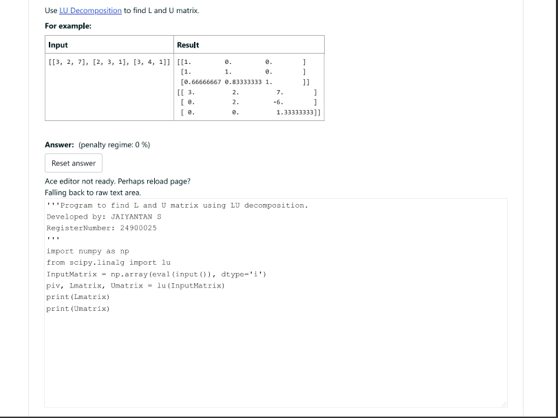
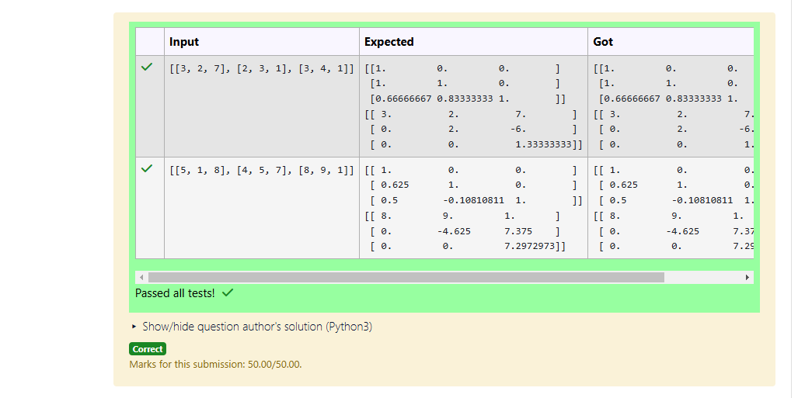
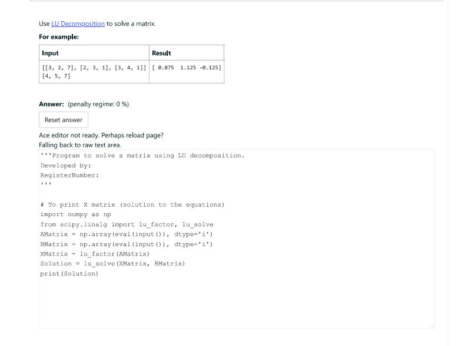
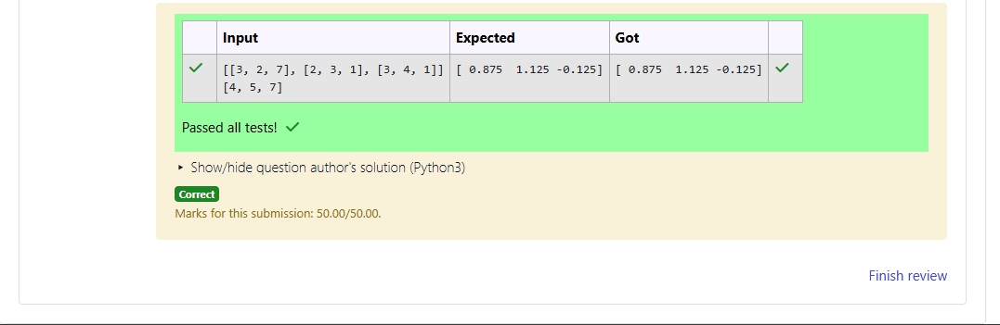

# LU Decomposition 

## AIM:
To write a program to find the LU Decomposition of a matrix.

## Equipments Required:
1. Hardware – PCs
2. Anaconda – Python 3.7 Installation / Moodle-Code Runner

## Algorithm
1. Start the program
2. Import the necessary libraries(numpy,scipy.linalg)
3. Define the matrix using numpy
4. Use lu(),lu_solve(),lu_factor() to get the solutions
5. End the program

## Program:
(i) To find the L and U matrix
```
/*
Program to find the L and U matrix.
Developed by: JAIYANTAN S
RegisterNumber: 24900025
*/
```
(ii) To find the LU Decomposition of a matrix
```
/*
Program to find the LU Decomposition of a matrix.
Developed by: JAIYANTAN S
RegisterNumber: 24900025
*/
```

## Output:






## Result:
Thus the program to find the LU Decomposition of a matrix is written and verified using python programming.

